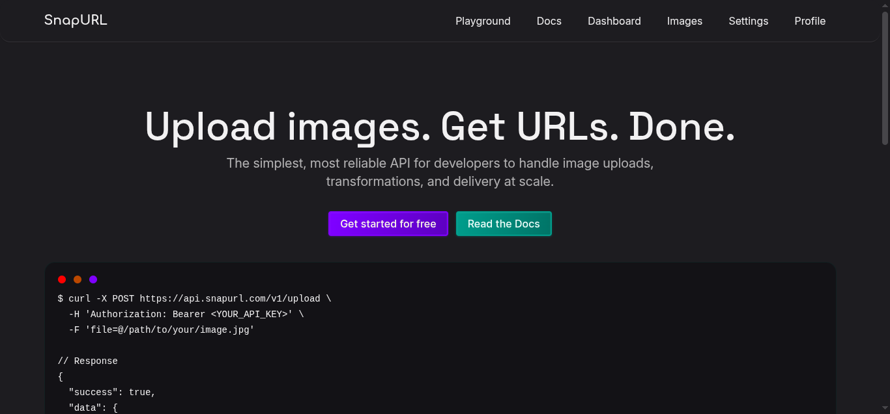
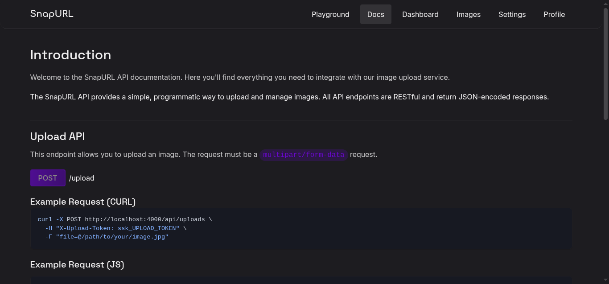
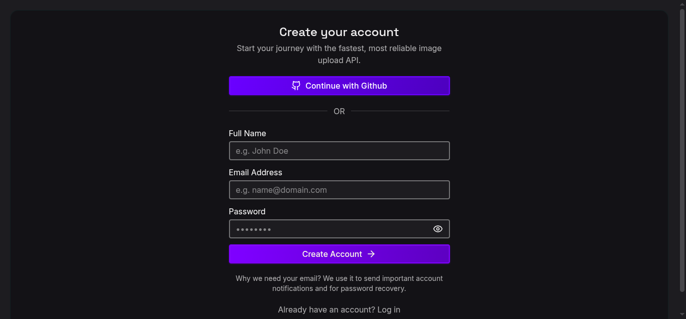
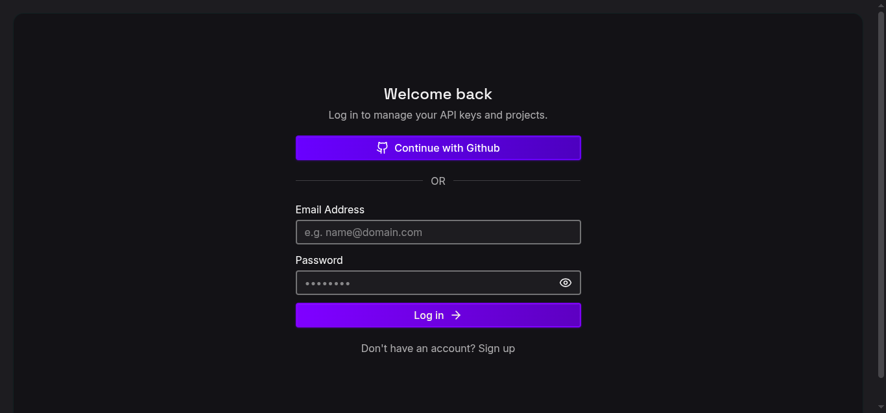
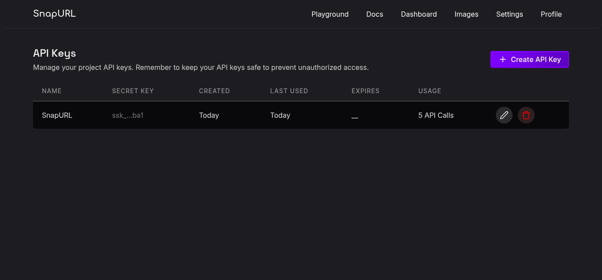
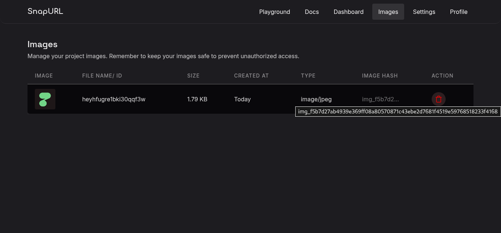
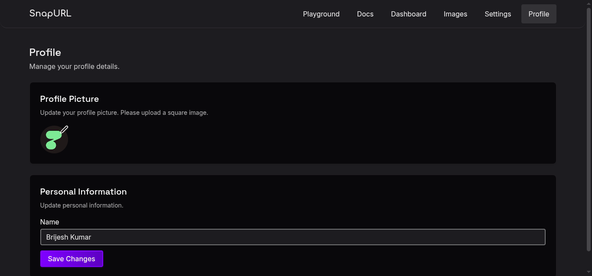
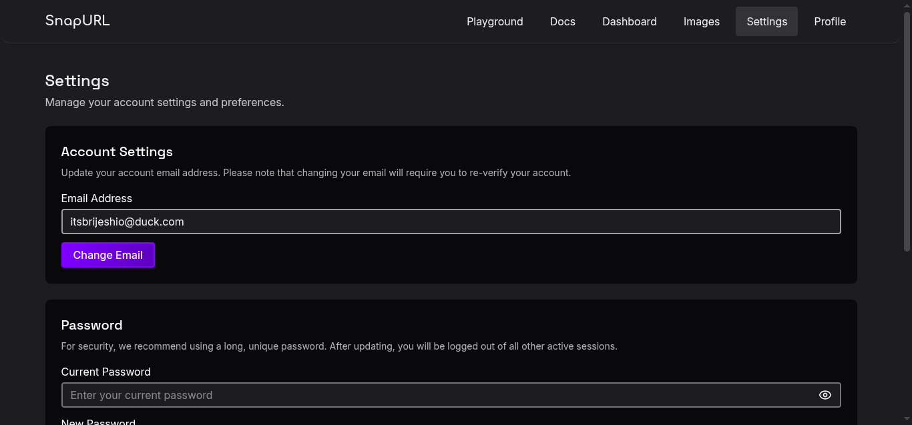

# SnapURL 🚀

**Upload images. Get URLs. Done.**

SnapURL is a developer-focused **SaaS image upload and delivery platform** designed for avatars, social media assets, and application-only image usage. It provides a secure, fast, and simple API to upload images and retrieve public URLs, with full dashboard, API key management, and authentication.

---

## 🌐 Live Preview

> [SnapURL](https://snap-url-delta.vercel.app/)

---

## ✨ Key Features

- Secure image uploads via API
- Public image URLs for instant access
- API key & upload token management
- JWT-based authentication with refresh tokens
- GitHub OAuth login
- User dashboard (images, API keys, profile)
- Image deletion & account management
- Optimized for avatars and app-only images

---

## **Page Screenshots**

**Home/Landing Page**


**Docs Page**


**Signup Page**


**Login Page**


**Dashboard Page**


**Images Page**


**Profile Page**


**Settings Page**


---

## 🏗️ Tech Stack

### Frontend

- **React.js**
- **TypeScript**
- **TanStack Query**
- React Router
- Axios
- Tailwind CSS / Custom UI
- GitHub OAuth (client)
- Dark mode-first design

### Backend

- **NestJS**
- **MongoDB + Mongoose**
- **JWT Authentication**
- **GitHub OAuth**
- **Argon2** (password hashing)
- Multer (multipart uploads)
- RESTful API architecture

---

## 🔐 Authentication Flow

- Email & Password authentication
- GitHub OAuth login
- Short-lived access tokens (JWT)
- Refresh token rotation
- Protected routes via JWT guards

---

## 📡 API Endpoints

### Base

```
GET /api
```

---

## 🔑 Auth Endpoints

```
POST /api/auth/signup
POST /api/auth/login
POST /api/auth/logout        (protected)
POST /api/auth/refresh
```

---

## 👤 User Endpoints (Protected)

```
GET    /api/users/me
PATCH  /api/users/me
PATCH  /api/users/me/avatar
PATCH  /api/users/change-email
PATCH  /api/users/change-password
DELETE /api/users/delete-account
```

---

## 🖼️ Image Upload & Delivery

### Upload Image (Core Feature)

```
POST /api/uploads
```

**Headers**

```json
{
  "Content-Type": "multipart/form-data",
  "X-Upload-Token": "your-upload-token"
}
```

**Body**

```json
{
  "file": "<image-file>"
}
```

---

### Get Image by Name

```
GET /api/images/:NAME
```

---

### Delete Image

```
DELETE /api/images/:IMAGE_TOKEN_HASH
```

---

### List Images (Protected)

```
GET /api/images
```

---

## 🔐 Secrets / API Keys (Protected)

```
POST   /api/secrets
GET    /api/secrets
DELETE /api/secrets/:ID
```

Used to generate **upload tokens** for secure API access.

---

## 🧪 Example cURL Upload

```bash
curl -X POST https://api.snapurl.com/api/uploads \
  -H "X-Upload-Token: ssk_UPLOAD_TOKEN" \
  -F "file=@avatar.jpg"
```

---

## 📊 Dashboard Capabilities

- View uploaded images
- Copy image URLs
- Delete images
- Manage API keys
- Monitor API usage
- Update profile & avatar
- Change email/password

---

## 🛡️ Security

- Argon2 password hashing
- JWT + Refresh token rotation
- Upload token validation
- File type & size validation
- Rate-limit ready architecture
- Image hash-based access control

---

## 🧠 Use Cases

- User avatars
- Social media previews
- App-only images
- Developer tools
- SaaS product assets

> ⚠️ Not intended for hosting public galleries or large media libraries.

---

## 🧑‍💻 Local Development

### Backend

```bash
cd backend
pnpm install
pnpm start:dev
```

### Frontend

```bash
cd frontend
pnpm install
pnpm dev
```

---

## 🔮 Future Enhancements

- Image transformations (resize, crop)
- CDN integration
- Usage-based billing
- Rate limiting per API key
- Webhooks
- Team workspaces

---

## 📜 License

MIT License

---

## 👨‍💻 Author

**Brijesh Kumar**
Built as a production-grade SaaS project to demonstrate full-stack system design, authentication, and API architecture.
